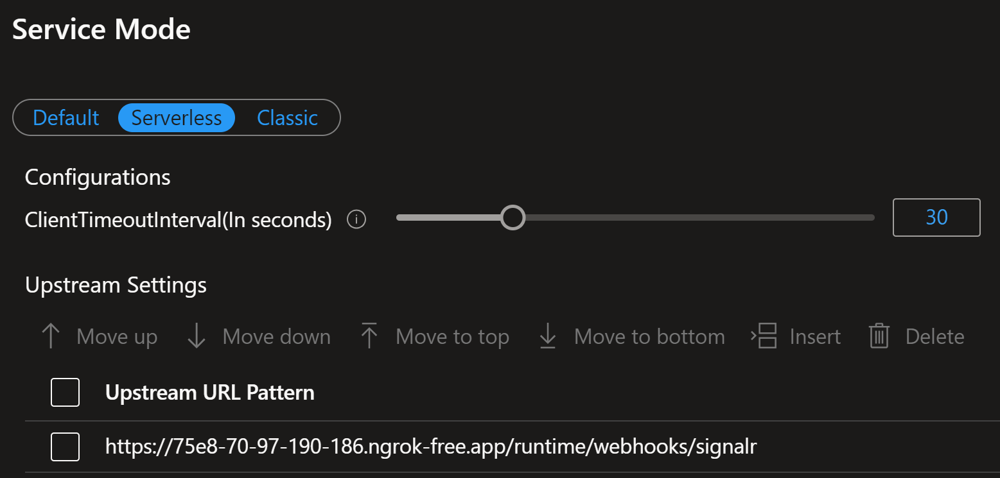

### Multitenant, Multiproduct SignalR Service

#### Define a Grouping Strategy
In a multitenant, multiproduct SaaS stack, the grouping strategy should allow flexibility for:

- All users across all tenants and target products.
- All users within a specific tenant.
- All users within a specific target product.
- All users within a target product within a specific tenant.
- A specific user in a specific tenant.
- A specific user in a specific tenant using a specific target product.

Here is a suggested approach:

Global Group: Use a fixed group name like `AllUsers`.
Tenant Groups: Use the tenant ID or name as the group name, e.g., `Tenant-{tenantId}`.
Product Groups: Use a product name to differentiate product specific applications, e.g., `MyAwesomeApplication`.
User Groups: Include the tenant and user identifier, e.g., `Tenant-{tenantId}-User-{userId}`.

#### Assign Users to Groups:
When a user connects to SignalR, map them to the appropriate group(s):

- Add all users to the `AllUsers` group.
- Add the user to their tenant group, e.g., `Tenant-{tenantId}`.
- Optionally, create a personal group for the user, e.g., `Tenant-{tenantId}-User-{userId}`.

### Development Environment Setup

#### Enabling CORS

Connecting a JavaScript/TypeScript client to a SignalR service like this one requires
the client to make a call to the negotiate endpoint over HTTP to get the connection
information. Once the connection information is retrieved, the client can connect to
the SignalR service directly using other transport methods and HTTP is no longer used.
However, that initial call to the negotiate endpoint requires CORS to be enabled on this SignalR
service if the client caller is on a different domain.

Information how to enable CORS can be found [here](https://learn.microsoft.com/en-us/azure/azure-signalr/signalr-concept-serverless-development-config?tabs=isolated-process#azure-functions-configuration).

Below is a typical configuration for enabling CORS on this SignalR service when running
locally.

````json
  "Host": {
    "CORS": "http://localhost:3000",
    "CORSCredentials": true
  }
````

#### User secrets

There are a number of secrets that are required to run this project. These secrets are
stored in the `secrets.json` file. Review the [Secret Manager](https://learn.microsoft.com/en-us/azure/azure-signalr/signalr-concept-serverless-development-config?tabs=isolated-process#azure-functions-configuration)
documentation to understand how the Secret Manager works with the `secrets.json` file.

The `secrets.template.json` file in this project contains the keys that are required.
The `secrets.json` file should be updated with appropriate values using the
`secrets.template.json` file as a guide. The `secrets.json` file can be accessed easily
by right-clicking on the SignalRService.Api project and selecting Manage User Secrets
from the context menu. The `secrets.json` file **should not** be checked into source
control.

#### Upstream URL

A Serverless SignalR resource in Azure uses the notion of an [`Upstream URL`](https://learn.microsoft.com/en-us/azure/azure-signalr/concept-upstream)
to communicate with the Azure Function that is providing the SignalR service
(__this solution__ is that SignalR service). The Azure Function serving as the SignalR
service in a serverless SignalR scenario can be thought of as a simplified version of the
traditional SignalR Hub that is required if not using the SignalR resource in serverless mode.
Going serverless simplifies the Hub implementation because the serverless SignalR resource
in Azure handles all of the connection management and message routing for you. There is no
need for you to write that code in a Hub. The only thing you are required to do is to
write the Azure Function that will implement the buisiness logic around the messages that
are sent and received. Your Azure function will be called by the serverless SignalR
resource in Azure when messages need to be sent or received. The `Upstream URL` is the
URL that the serverless SignalR resource in Azure uses to communicate with your Azure
Function. 

To set the `Upstream URL` on the SignalR resource in Azure, navigate to the SignalR
resource in the Azure portal and click on the `Settings` tab. There is a field on the
`Settings` tab called `Upstream URL Pattern`. This is the URL for your Azure function. The
`Upstream URL Pattern` takes the following form:

````text
https://<functionapp-url>/runtime/webhooks/signalr?code=<function-key>
````
Note the `<function-key>` parameter in the URL. This is the key that is used to authenticate
the SignalR resource to the Azure Function. See the section below for a discussion on what
this value is, how to get it, and how to use it.

Below is an example of the `Upstream URL Pattern` for an Azure Function running in Azure:

````text
````

This all works well and good when the Azure function is deployed to Azure and has a public
URL that can be reached by the SignalR resource; however, when developing locally, the
Azure function is not deployed to Azure and does not have a public URL. In this case, the
`Upstream URL` on the SignalR resource in Azure must be set to the URL of the Azure
function running locally. To make this work, use [ngrok](https://ngrok.com/) to expose
the Azure function running locally to the internet. Ngrok will provide a public URL that
can be used as the `Upstream URL` on the SignalR resource in Azure. When running locally,
the `<function-key>` value is not necessary. The `<function-key>` authorization is only
required when the Azure function is deployed to Azure.

Below is an example of the `Upstream URL Pattern` for an Azure Function running locally:

````text
https://75e8-70-97-190-186.ngrok-free.app/runtime/webhooks/signalr
````


Note on the Azure portal page for setting the `Upstream URL`, at the time of this writing
there are some weird idiosyncracies with the page. The setting doesn't always save, and
even when it does, navigating away from the page will always warn that there are
unsaved changes even though the changes were saved. In the case of the warning, you just
have to click the `OK` button when it says the unsaved edits will be discarded. In the
case of settings not being saved, I have found that the only way to guarantee that the
setting gets saved is to navigate away from the edit field after you've made the change,
then click the `Save` button to save the changes.

### Resources

- [Azure Function development and configuration with Azure SignalR Service](https://learn.microsoft.com/en-us/azure/azure-signalr/signalr-concept-serverless-development-config?tabs=isolated-process)]